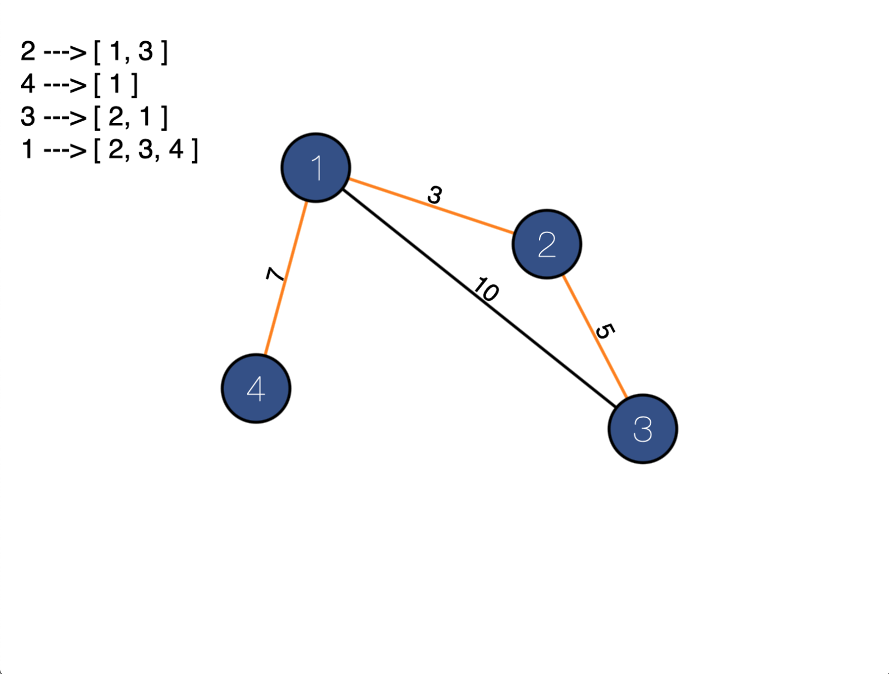
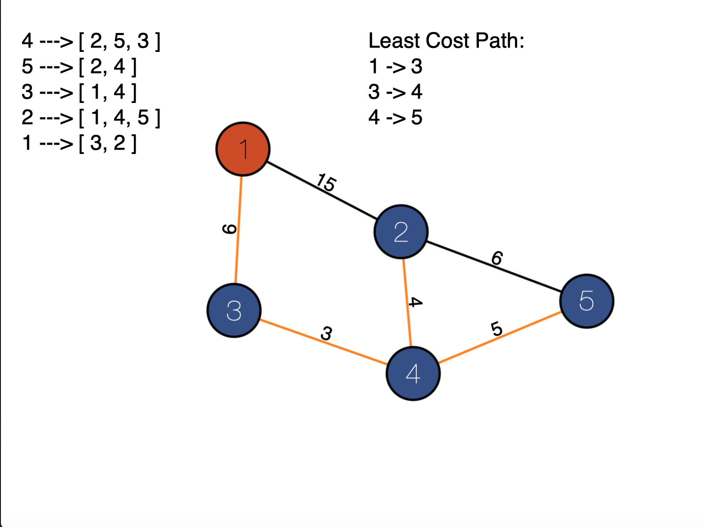

# Trabalho 2 de Grafos
Neste repositório você encontrará um editor de grafos onde você pode criar o seu grafo(criando os nós, arestas e seus pesos) e ele automaticamente irá gerar e mostrar na tela a árvore geradora mínima do grafo utilizando o Algoritmo de Prim.

Além disso, também é possível ver o menor caminho entre dois respectivos nós, utilizando o algoritmos de Dijkstra.

## Demonstração

* Vídeo 

* Árvore Geradora Mínima

* Menor Caminho

## Comandos
- Para criar um nó, clique na tela com o botão esquerdo do mouse.
- Para criar uma aresta, clique em um nó, arraste até outro nó, e solte o botão. Abrirá uma caixa de texto para inserir o peso do nó
- Para apagar o grafo, aperte a barra de espaço.
- Para apagar uma aresta, arreste o mouse para cima da aresta a ser deletada e clique com o botão esquerdo do mouse no botão "x" que vai aparecer em cima da aresta.
- Para ver o menor caminho entre dois nós basta clicar com o botão direito em um nó e em seguida clicar com o botão direito em outro nó.

## Alunos:

|Nome|Matrícula|
|--|--|
|Luis Gustavo Avelino |15/0016310|
|Matheus Felizola|17/0019098|

## Trabalho 1

Para acessar o trabalho 1 [clique aqui](https://github.com/projeto-de-algoritmos/Trabalhos-1-e-2---Grafos---Luis-Gustavo-Avelino-e-Matheus-Felizola)