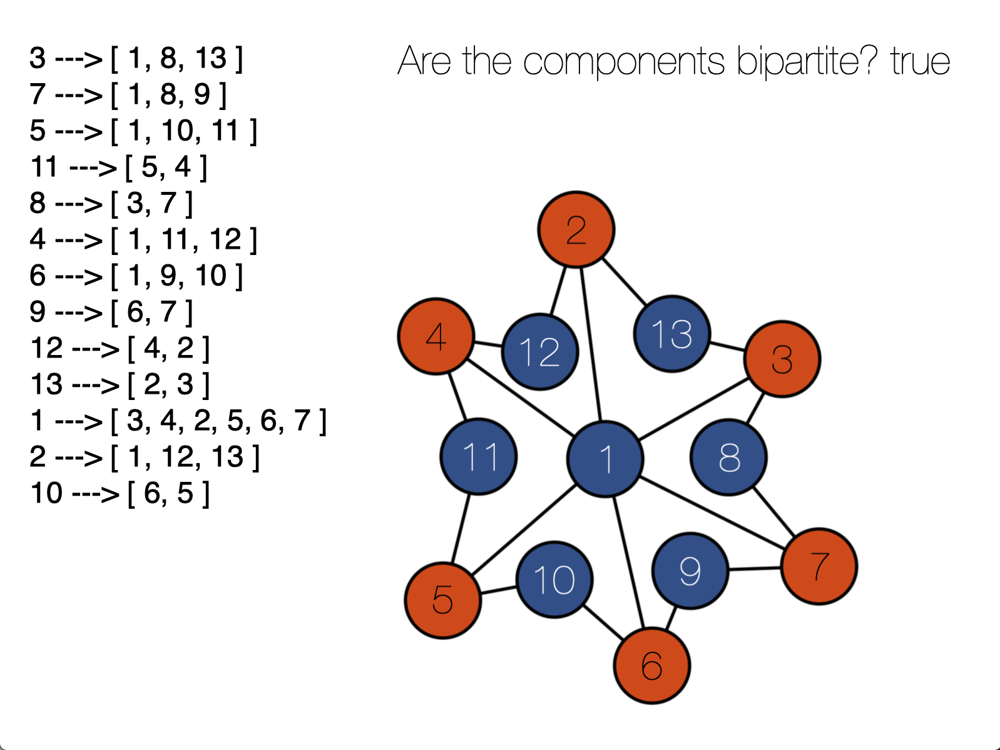
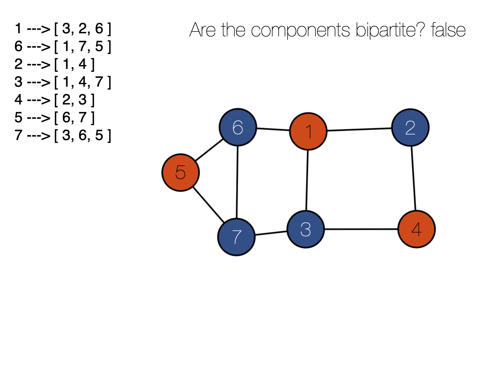

# Trabalho 1 de Grafos
Neste repositório você encontrará um editor de grafos que diz se todos os componentes do grafo desenhado são bipartidos ou não. Cada nó é pintado de acordo com sua camada, de forma alternada. Se houverem dois nós da mesma camada com uma aresta entre eles, o algoritmo detecta isso e classifica o grafo como não bipartido.

Como o algoritmo padrão para detectar a bipartição só faz sentido em grafos conectados, e o editor permite desenhar grafos não-conectados, foi feita uma alteração no algoritmo para que detecte se todos os componentes do grafo (não-direcionado) são bipartidos.

## Comandos
- Para criar um nó, clique na tela com o botão esquerdo do mouse.
- Para criar uma aresta, clique em um nó, arraste até outro nó, e solte o botão.
- Para apagar o grafo, aperte a barra de espaço.

## Alunos:

|Nome|Matrícula|
|--|--|
|Luis Gustavo Avelino |15/0016310|
|Matheus Felizola|17/0019098|
